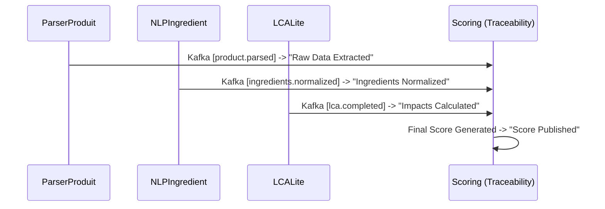

# EcoLabel-MS

Plateforme microservices pour le calcul du score environnemental des produits. Architecture event-driven : Kafka orchestre le flux Parser → NLP → LCA → Scoring → Widget. Postgres centralise les données, Eureka pour la découverte, Prometheus/Grafana pour l’observabilité. Docker Compose orchestre l’ensemble.

## Microservices

| Service | Port | Rôle |
| --- | --- | --- |
| `eureka` | 8761 | Registre Eureka (service discovery & load balancer). |
| `authservice` | 8080 | Gestion des comptes et JWT. |
| `ml-service` | 8086 | Service Python ML/IA : OCR (Tesseract), NLP (spaCy + BERT). |
| `parserproduitservice` | 8081 | Ingestion fiche produit (texte/PDF/image → OCR via ML), publie `product.parsed`. |
| `nlpingredientservice` | 8082 | Extraction/normalisation ingrédients, publie `ingredients.normalized`. |
| `lcaliteservice` | 8083 | LCA simplifié (FastAPI/Python), consomme `ingredients.normalized`, publie `lca.completed`. |
| `scoringservice` | 8084 | Agrégation ACV → score A–E, publie `score.published`. Stocke la **Traçabilité**. |
| `widgetapi` | 8085 | API publique pour exposer le score (Catalogue visuel + JSON). |
| `minio` | 9000/9001 | Stockage artefacts LCA (reports JSON). |

## 🔗 Widget API (Consommation Publique)
Le `widgetapi` est conçu pour être intégré par des sites tiers (e-commerce, comparateurs). Il offre une vue simplifiée et optimisée du catalogue.

- **Catalogue Visuel** : `http://localhost:8085/public/product/`  
  Une interface web propre pour parcourir les produits certifiés et leurs scores sans notation JSON complexe.
- **Liste Complète (JSON)** : `http://localhost:8085/public/product/all`  
  Liste technique de tous les scores disponibles.
- **Détails Produit (JSON)** : `http://localhost:8085/public/product/{productId}`  
  API RESTful retournant le score, la lettre impact, et les métriques détaillées (CO2, Eau, Énergie).

## 🕵️‍♂️ Traçabilité (Event Sourcing)
Le système implémente une traçabilité complète du cycle de vie du calcul via Kafka. Chaque étape majeure est enregistrée comme une "Provenance" dans le `scoringservice`.

### Architecture du flux :


### Consultation :
- **Endpoint API** : `GET http://localhost:8084/score/provenance/{productId}`
- **Visualisation Frontend** : Disponible sur la page "Traceability" de l'application React. Elle affiche une timeline interactive basée sur ces événements Kafka.

## Monitoring
Prometheus scrute les services Spring via `/actuator/prometheus` et `lcaliteservice` via `/metrics`. Grafana (3001) avec datasource Prometheus (`http://prometheus:9090`). Kafka UI disponible sur `http://localhost:9000`.

## LCALite (Python FastAPI)

- Consomme `ingredients.normalized`, calcule CO2 / eau / énergie avec facteurs de démo, persiste dans Postgres et dédoublonne via `lca_processed_events`.
- Publie `lca.completed` (événement enrichi + compatibilité scoring avec champs `co2Kg`, `waterLiters`, `energyMj`).
- Génère un artefact JSON stocké dans MinIO `minio://ecolabel-acv/reports/<productId>/<runId>.json`.
- API REST :
  - `POST /lca/calc` (payload identique à l’événement consommé)
  - `GET /lca/product/{productId}` (dernier résultat)
  - `GET /health`, `GET /metrics`

## Lancement rapide

```bash
docker compose up --build
```

UI utiles : Eureka `http://localhost:8761`, Kafka UI `http://localhost:9000`, Prometheus `http://localhost:9090`, Grafana `http://localhost:3001`, MinIO API `http://localhost:9002`, MinIO console `http://localhost:9003` (minioadmin/minioadmin).

## Frontend ACV
- Vite dev origin : `http://localhost:5173`. Assurez-vous que `ecolabel-frontend/.env` contient `VITE_LCA_URL=http://localhost:8083`.
- Démarrage : dans `ecolabel-frontend/` exécuter `npm install` puis `npm run dev`.
